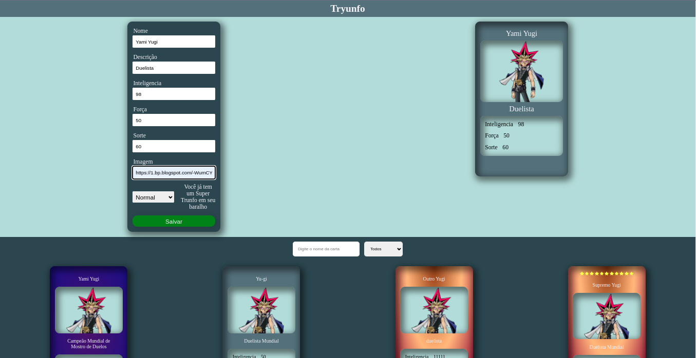

# Tryunfo



# Índice

* [Título e Imagens Home](#tryunfo)
* [tecnologias utilizadas](#tecnologias-utilizadas)
* [Descrição do projeto](#descrição-do-projeto)
* [Status do Projeto](#status-do-projeto)
* [Funcionalidade do projeto](#🔨-funcionalidade-do-projeto)
* [Acesso ao Projeto](#acesso-ao-projeto)

# Tecnologias utilizadas


# Descrição do Projeto

O projeto "Tryunfo" é parte do currículo da formação de Desenvolvedor Web da [Trybe](https://www.betrybe.com/). Nesse projeto, os alunos têm a oportunidade de aplicar seus conhecimentos React e JavaScript para criar uma aplicação de criação de cartas para um jogo.

# Status do Projeto

> 💹 Alpha 💹

# 🔨 Funcionalidade do projeto

- Salvar a carta
- Excluir a cart
- Selecionar a Raridade
- Selecionar 1 Super Trunfo
- adicionar uma imagem pelo url

# Acesso ao projeto

Para acessar e executar este projeto, siga os passos abaixo:

1. Certifique-se de ter o Node.js e o npm instalados em sua máquina.

2. Clone o Projeto

```bash
git clone https://github.com/EversonDias/Tryunfo_with_React.js_JavaScript_and_Styled_Components.git Tryunfo
```

3. Entre no projeto

```bash
cd Tryunfo
```

4. Instale as Dependências

```bash
npm install
```

5. inicie o projeto

```bash
npm start
```
